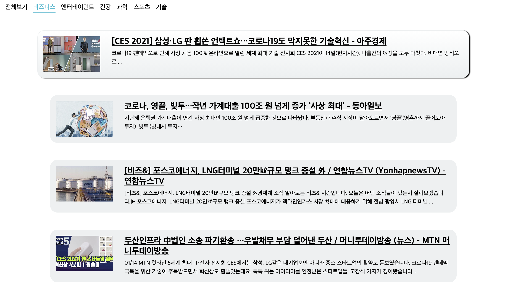

### React News_Viewer

---

## What I developed.



## Description

> 다음과 같은 형식으로 개발을 진행
>
> ```
> <App>
>  <Category/>
>  <NewsList>
>   <NewsItem> * 기사의 개수
>  </NewsList>
> </App>
> ```

> Components
>
> - Category Component  
>   특정 카테고리(전체, 비즈니스, 엔터 etc)를 선택해 기사를 받아오도록 한다.
> - NewsList Component  
>   선택된 카테고리와 usePromise()를 통해 받아온 기사를 NewsItem으로 반복 생성
> - NewsItem Component
>   특정 기사의 이미지, 헤드라인, 내용을 보여주며, 헤드라인을 클릭할 시 해당 신문사의 원문으로 이동한다.

> Pages
>
> - Route를 이용해 카테고리를 선택하고, 해당 기사를 부를 수 있도록 한다.

> lib
>
> - usePromise custom hook을 만들어 사용했다
> - 첫번째 인자는 특정 카테고리 axios.get() 함수이다.
> - 두번째 인자는 함수가 실행되야 하는 deps이다.
